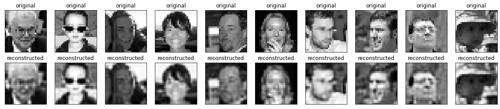

# AutoEncodersImageCompression
Using Auto Encoders for image compression

# Introduction

This project mainly follows the Tensorflow Autoencoders Tutorial (More info at: https://www.tensorflow.org/tutorials/generative/autoencoder)

The notebook contains the steps taken to compress an 28x28 size image to a 7x7 size array which occupies roughly 0.5x space occupied by the original images

## Applications

1. Datatransfer - Video calls or moving streaming in low bandwidth conditions

2. Datastorage - storing data, especially that which is not retrieved daily and where resolution isn't an issue

# Dataset

The dataset I used for this project is the **Flickr-Faces-HQ Dataset (FFHQ)** and all the images produced by me as test results are published under the **Creative Commons BY-NC-SA 4.0 License**

## Acknowledgement

Flickr-Faces-HQ (FFHQ) is a high-quality image dataset of human faces, originally created as a benchmark for generative adversarial networks (GAN):

> **A Style-Based Generator Architecture for Generative Adversarial Networks**<br>
> Tero Karras (NVIDIA), Samuli Laine (NVIDIA), Timo Aila (NVIDIA)<br>
> https://arxiv.org/abs/1812.04948


# Usage

The Notebook file ***AutoEncoderImageCompression.ipynb*** contains steps from loading dataset to training an auto encoder to reproduce the below results.

The ***AutoEncoderImageCompression.ipynb*** notebook is run as a Google Colab Notebook

## Steps to prepare the dataset

1. To create the dataset use the github [repository](https://github.com/NVlabs/ffhq-dataset) of Flickr-Faces-HQ Dataset (FFHQ) which provides a script to download all the images, I have used it to download only the thumbnail (128x128) images

2. All the images files are then collected to a single folder using the ```collect_dataset_from_sub_dirs.py``` file

3. The image files are then converted to grayscale and resized to 28x28 size images using the ```resize_and_save_gray.py``` file

# Results

The 28x28 size input image is converted to a 7x7 vector which is then passed through a decoder to obtain the reconstructed images.

The compression ratio is about 2.0x 




